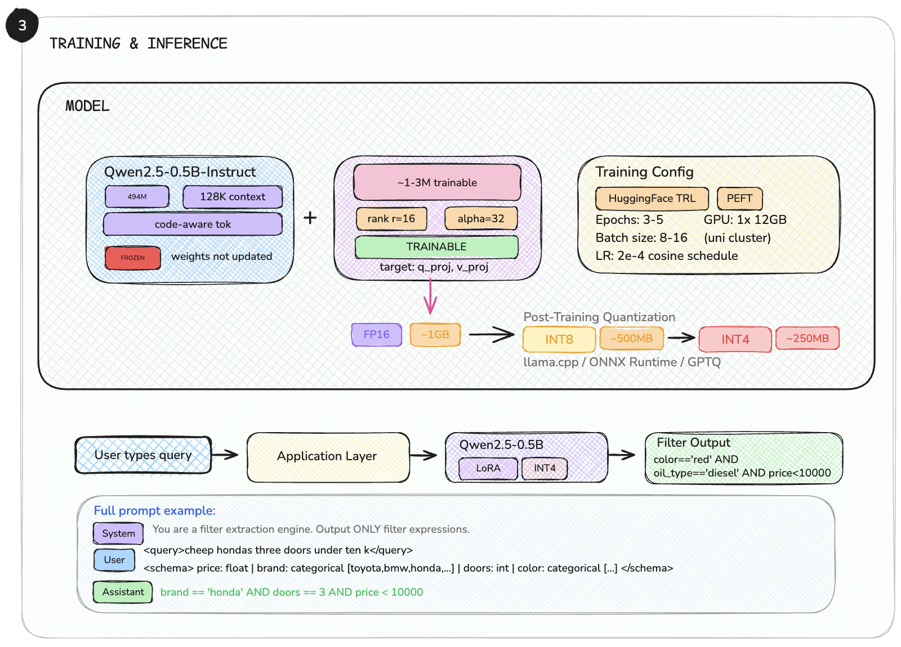
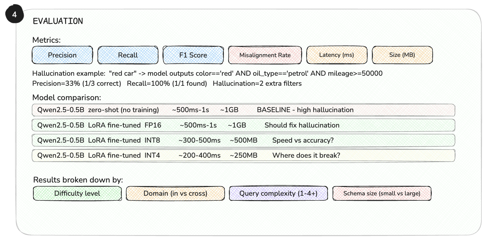

# AutoFilter

**Natural-language queries → structured filter expressions**, powered by LoRA fine-tuned LLMs.

```
User:  "cheap Toyota cars under 20k with low mileage"
Model: brand == 'toyota' AND price < 20000 AND mileage < 50000
```

AutoFilter fine-tunes a language model with LoRA to convert free-form, often misspelled or slang-heavy queries into precise, schema-aware filter expressions — no prompt engineering or large API calls required at inference time. The base model is configurable via `config.yaml`.

---

## Table of Contents

- [AutoFilter](#autofilter)
  - [Table of Contents](#table-of-contents)
  - [How It Works](#how-it-works)
    - [Pipeline Stages](#pipeline-stages)
  - [Project Structure](#project-structure)
  - [Installation](#installation)
    - [Prerequisites](#prerequisites)
    - [Install uv](#install-uv)
    - [Install Dependencies](#install-dependencies)
    - [Verify Installation](#verify-installation)
  - [Running on a SLURM Cluster (UoE)](#running-on-a-slurm-cluster-uoe)
  - [Running on RunPod](#running-on-runpod)
  - [Configuration](#configuration)
    - [Configuration Reference](#configuration-reference)
  - [CLI Usage](#cli-usage)
    - [Train](#train)
    - [Predict](#predict)
    - [Evaluate](#evaluate)
    - [List Schemas](#list-schemas)
    - [Data Stats](#data-stats)
  - [Data Format](#data-format)
    - [Schemas](#schemas)
    - [Training Data](#training-data)
  - [Model Details](#model-details)
  - [Evaluation Framework](#evaluation-framework)
    - [Metrics](#metrics)
      - [Core Quality Metrics](#core-quality-metrics)
      - [Schema Alignment Metrics](#schema-alignment-metrics)
      - [Structural Metrics](#structural-metrics)
      - [Fine-Grained Metrics](#fine-grained-metrics)
    - [Difficulty Categories](#difficulty-categories)
    - [Adding a New Metric](#adding-a-new-metric)
  - [Quantization](#quantization)
  - [Architecture Diagrams](#architecture-diagrams)
    - [Training \& Inference Pipeline](#training--inference-pipeline)
    - [Evaluation Framework](#evaluation-framework-1)
  - [Adding New Datasets](#adding-new-datasets)
    - [Filter Expression Syntax](#filter-expression-syntax)

---

## How It Works

```
┌─────────────────┐     ┌────────────────┐     ┌──────────────────┐
│  Natural-Language│     │   Base LLM     │     │   Structured     │
│  Query + Schema  │ ──► │   + LoRA       │ ──► │   Filter Expr    │
│                  │     │   (fine-tuned)  │     │                  │
└─────────────────┘     └────────────────┘     └──────────────────┘
```

1. **Schema-aware prompting** — Each query is paired with a compact text representation of the target dataset's columns, types, and value ranges.
2. **LoRA fine-tuning** — Only a small fraction of model parameters are trained, keeping the process fast and memory-efficient.
3. **Cross-domain generalization** — 10 schemas are held out during training to measure how well the model handles unseen datasets.

### Pipeline Stages

| Stage | Description | Module |
|-------|-------------|--------|
| **Data loading** | Load ~45k query–filter pairs, split by schema into train/eval | `src/data_loader.py` |
| **Training** | LoRA fine-tune the base model with SFTTrainer | `src/train.py` |
| **Inference** | Generate filter expressions from new queries | `src/inference.py` |
| **Evaluation** | 12 metrics with per-schema and per-difficulty breakdowns | `src/evaluate/` |

---

## Project Structure

```
AutoFilter/
├── main.py                          # Entry point
├── config.yaml                      # Default configuration (all hyperparameters)
├── pyproject.toml                   # Project metadata and dependencies (uv)
├── uv.lock                          # Locked dependency versions
├── requirements.txt                 # Legacy pip requirements
├── src/
│   ├── __init__.py
│   ├── cli.py                       # Typer CLI (train, predict, evaluate, schemas, data-stats)
│   ├── config.py                    # Pydantic config with YAML loading
│   ├── data_loader.py               # Schema formatting + HF Dataset construction
│   ├── train.py                     # LoRA fine-tuning with SFTTrainer
│   ├── inference.py                 # Model loading + filter generation (fp16/int8/int4)
│   └── evaluate/                    # Modular evaluation framework
│       ├── __init__.py              # Package entry point
│       ├── base.py                  # BaseMetric ABC, SampleContext, EvaluationResult
│       ├── orchestrator.py          # Loads model, runs inference, computes all metrics
│       ├── parsing.py               # Shared utilities (clause parsing, field extraction)
│       ├── precision.py             # Clause-level precision
│       ├── recall.py                # Clause-level recall
│       ├── f1.py                    # Harmonic mean of precision and recall
│       ├── exact_match.py           # Full expression exact match
│       ├── field_accuracy.py        # Fraction of predicted fields valid in schema
│       ├── hallucination.py         # Extra predicted clauses not in ground truth
│       ├── misalignment.py          # Predicted fields not in schema
│       ├── latency.py               # Inference time (avg, p50, p95)
│       ├── structural_validity.py   # Balanced parens + valid operators
│       ├── complexity_accuracy.py   # Correct clause count match
│       ├── operator_accuracy.py     # F1 over operator multiset
│       └── value_accuracy.py        # F1 over literal values
├── schemas/                         # JSON dataset schemas (~250 schemas)
│   ├── used_cars.json
│   ├── netflix_shows.json
│   └── ...
├── data/
│   └── data.json                    # ~45k query → filter training samples
├── scripts/                         # Data generation scripts
│   ├── generate_synthetic_schemas.py
│   └── generate_synthetic_schemas_extra.py
├── docs/
│   ├── train.png                    # Training & inference architecture diagram
│   └── eval.png                     # Evaluation framework diagram
└── output/                          # Created during training
    └── final_adapter/               # Saved LoRA adapter + tokenizer
```

---

## Installation

Clone the repository first:

```bash
git clone <repo-url> && cd AutoFilter
```

### Prerequisites

- Python 3.10+
- CUDA-capable GPU recommended (CPU works but is slow)
- [uv](https://docs.astral.sh/uv/) — fast Python package and project manager

### Install uv

| Platform | Command |
|----------|---------|
| **macOS** | `curl -LsSf https://astral.sh/uv/install.sh \| sh` or `brew install uv` |
| **Linux** | `curl -LsSf https://astral.sh/uv/install.sh \| sh` |
| **Windows** | `powershell -ExecutionPolicy ByPass -c "irm https://astral.sh/uv/install.ps1 \| iex"` |

### Install Dependencies

```bash
uv sync                              # Creates .venv and installs everything
source .venv/bin/activate            # macOS / Linux
# .venv\Scripts\activate             # Windows
```

> **Tip:** You can skip activation and use `uv run python main.py ...` instead, which runs inside the venv automatically.

### Install Unsloth (GPU only)

Unsloth must be installed separately from GitHub with a hardware-specific flag — the PyPI version is outdated and incompatible with TRL 0.29+.

**Auto-detect the correct command for your environment:**

```python
python3 -c "
import torch, re
from packaging.version import Version as V
v = V(re.match(r'[0-9\.]{3,}', torch.__version__).group(0))
cuda = str(torch.version.cuda)
is_ampere = torch.cuda.get_device_capability()[0] >= 8
if   v < V('2.5.0'): x = 'cu{}{}-torch240'
elif v < V('2.5.1'): x = 'cu{}{}-torch250'
elif v <= V('2.5.1'): x = 'cu{}{}-torch251'
elif v < V('2.7.0'): x = 'cu{}{}-torch260'
else: x = 'cu{}{}-torch270'
x = x.format(cuda.replace('.',''), '-ampere' if is_ampere else '')
print(f'pip install --upgrade pip && pip install --no-deps git+https://github.com/unslothai/unsloth-zoo.git && pip install \"unsloth[{x}] @ git+https://github.com/unslothai/unsloth.git\" --no-build-isolation')
"
```

**L40S (CUDA 12.4, torch 2.6):**

```bash
pip install --upgrade pip && \
pip install --no-deps git+https://github.com/unslothai/unsloth-zoo.git && \
pip install "unsloth[cu124-ampere-torch260] @ git+https://github.com/unslothai/unsloth.git" --no-build-isolation
```

### Verify Installation

```bash
python main.py --help
python main.py data-stats
python main.py schemas
```

You should see output like:

```
Train:  11250
Eval:   1800
Total:  13050

Eval schemas: hotel_bookings, job_listings, restaurant_business_rankings_2020, ...
```

> **Note:** For GPU support, ensure you have CUDA drivers installed. On headless servers (e.g., RunPod, Lambda), CUDA is typically pre-installed.

---

## Running on a SLURM Cluster (UoE)

The university cluster has **no internet on GPU nodes**, so all downloads must happen on the login node first. TensorBoard is used for logging (wandb is disabled by default).

### 1. Setup on the Login Node (has internet)

```bash
# Install uv and add to PATH
curl -LsSf https://astral.sh/uv/install.sh | sh
source $HOME/.local/bin/env

# Clone and install dependencies
git clone -b main https://github.com/anardashdamir/UOE-mlp-cw-G083.git
cd UOE-mlp-cw-G083
uv sync
source .venv/bin/activate

# Download the model while you still have internet
huggingface-cli download Qwen/Qwen2.5-0.5B-Instruct
```

### 2. Request a GPU Node

```bash
srun --partition=Teaching --gres=gpu:1 --time=12:00:00 --mem=36G --nodelist=landonia21 --pty bash
```

### 3. Train on the GPU Node (no internet)

```bash
# Re-source uv and activate the venv
source $HOME/.local/bin/env
cd UOE-mlp-cw-G083
source .venv/bin/activate

# Train (HuggingFace uses cached model, TensorBoard logs locally)
python main.py train
```

Training logs are saved to `output/tb_logs/<run_name>/` with auto-generated experiment names like:

```
qwen2.5-0.5b-instruct_r8_a32_lr2e-05_ep3_20260311-143022
```

### 4. View TensorBoard Logs

On the login node (or your local machine after copying `output/tb_logs/`):

```bash
tensorboard --logdir output/tb_logs/ --port 6006
```

From your local machine, SSH tunnel to view in the browser:

```bash
ssh -L 6006:localhost:6006 <username>@<cluster-host>
# Then open http://localhost:6006
```

### Tips

- **Override hyperparameters from the CLI:** `python main.py train --epochs 5 --lr 1e-4`
- **If you need wandb**, set `wandb.enabled: true` in `config.yaml` and run on the login node (which has internet)
- **Model is cached** in `~/.cache/huggingface/hub/` — no re-download needed after the first time

---

## Running on RunPod

RunPod instances come with CUDA pre-installed and have full internet access.

### 1. Install uv and Clone

```bash
curl -LsSf https://astral.sh/uv/install.sh | sh
source $HOME/.local/bin/env

git clone -b main https://github.com/anardashdamir/UOE-mlp-cw-G083.git
cd UOE-mlp-cw-G083
uv sync
source .venv/bin/activate
```

### 2. (Optional) Enable W&B Logging

Since RunPod has internet, you can use wandb:

```bash
# Create wandb.env with your API key
echo "WANDB_API_KEY=your_key_here" > wandb.env
```

Then enable it in `config.yaml`:

```yaml
wandb:
  enabled: true
```

Or just use TensorBoard (the default) — no extra setup needed.

### 3. Train

```bash
# The model downloads automatically on first run
python main.py train

# Custom run
python main.py train --epochs 5 --lr 1e-4 --batch-size 4
```

### 4. Evaluate

```bash
# Full evaluation
python main.py evaluate

# Zero-shot baseline
python main.py evaluate --zero-shot

# Compare quantization modes
python main.py evaluate -q fp16 -q int8 -q int4
```

### 5. View TensorBoard (if using default logging)

```bash
tensorboard --logdir output/tb_logs/ --port 6006 --bind_all
```

Then open `http://<runpod-ip>:6006` in your browser. If using a RunPod HTTP port, map port 6006 in your pod settings.

---

## Configuration

All settings live in `config.yaml` at the project root. The config is loaded via Pydantic, so values are validated at startup.

```yaml
# config.yaml
model:
  name: Qwen/Qwen3-4B-Instruct-2507

lora:
  r: 8
  alpha: 32
  dropout: 0.05
  target_modules:
    - q_proj
    - v_proj

training:
  num_epochs: 3
  batch_size: 8
  gradient_accumulation_steps: 4
  learning_rate: 2e-5
  lr_scheduler_type: cosine
  warmup_ratio: 0.05
  max_seq_length: 1024
  max_steps: -1

generation:
  max_new_tokens: 256
  temperature: 0.0

paths:
  data_path: data/data.json
  schema_dir: schemas
  output_dir: output

eval:
  schemas:
    - hotel_bookings
    - job_listings
    - restaurant_business_rankings_2020
    - wine_reviews
    - zoo_animals
    - diabetes
    - diamonds
    - electric_vehicles
    - nba_players
    - youtube_statistics
```

**Priority order:** CLI flags > config.yaml > built-in defaults.

```bash
# Use a different config file
python main.py train --config experiments/big_lora.yaml

# CLI flags override config.yaml values
python main.py train --epochs 10 --lr 1e-4
```

### Configuration Reference

| Parameter | Default | Description |
|-----------|---------|-------------|
| `model.name` | `Qwen/Qwen3-4B-Instruct-2507` | HuggingFace model name or local path |
| `lora.r` | 8 | LoRA rank (higher = more capacity, more memory) |
| `lora.alpha` | 32 | LoRA scaling factor |
| `lora.dropout` | 0.05 | Dropout probability for LoRA layers |
| `lora.target_modules` | `[q_proj, v_proj]` | Transformer modules to apply LoRA to |
| `training.num_epochs` | 3 | Number of training epochs |
| `training.batch_size` | 8 | Per-device training batch size |
| `training.gradient_accumulation_steps` | 4 | Effective batch = batch_size × this value |
| `training.learning_rate` | 2e-5 | Peak learning rate |
| `training.lr_scheduler_type` | cosine | LR schedule (cosine, linear, constant) |
| `training.warmup_ratio` | 0.05 | Fraction of steps for LR warmup |
| `training.max_seq_length` | 1024 | Max token length (truncates longer sequences) |
| `training.max_steps` | -1 | Max steps (-1 = use num_epochs) |
| `generation.max_new_tokens` | 256 | Max tokens to generate during inference |
| `generation.temperature` | 0.0 | Sampling temperature (0.0 = greedy decoding) |
| `generation.eval_batch_size` | 16 | Batch size for evaluation inference |

---

## CLI Usage

All commands are accessible via the Typer CLI:

```bash
python main.py [COMMAND] [OPTIONS]
```

Run `python main.py --help` to see all available commands.

### Train

Fine-tune the model on your filter dataset:

```bash
# Default settings from config.yaml
python main.py train

# Custom training run
python main.py train --epochs 5 --lr 1e-4 --batch-size 4 --lora-r 32

# Quick test run (100 steps only)
python main.py train --max-steps 100

# Use a different config file
python main.py train --config experiments/big_lora.yaml

# Custom output directory
python main.py train --output-dir output/experiment_1
```

**Options:**

| Flag | Short | Default | Description |
|------|-------|---------|-------------|
| `--config` | `-c` | `config.yaml` | Path to config file |
| `--epochs` | `-e` | 3 | Number of training epochs |
| `--batch-size` | `-b` | 8 | Per-device batch size |
| `--lr` | | 2e-5 | Learning rate |
| `--lora-r` | | 8 | LoRA rank |
| `--output-dir` | `-o` | `output/` | Where to save the adapter |
| `--max-steps` | | -1 | Max steps (-1 = use epochs) |

**What happens during training:**

1. Loads the base model from HuggingFace (downloads on first run)
2. Applies LoRA adapters to the specified modules
3. Trains on the filter dataset using SFTTrainer (from the `trl` library)
4. Saves the adapter weights to `output/final_adapter/`
5. Logs metrics to TensorBoard (default) or W&B (if enabled in config)

### Predict

Generate filter expressions from natural-language queries:

```bash
# Basic prediction
python main.py predict "cheap red Toyota cars" schemas/used_cars.json

# With lower temperature (more deterministic)
python main.py predict "Netflix shows from 2020" schemas/netflix_shows.json -t 0.0

# Using INT4 quantization (saves VRAM)
python main.py predict "budget hotels in Paris" schemas/hotel_bookings.json -q int4

# Using INT8 quantization
python main.py predict "expensive wines from France" schemas/wine_reviews.json -q int8
```

**Example output:**

```
Query:   cheap red Toyota cars
Filters: brand == 'toyota' AND color == 'red' AND price < 10000
```

**Options:**

| Flag | Short | Default | Description |
|------|-------|---------|-------------|
| `--config` | `-c` | `config.yaml` | Path to config file |
| `--temperature` | `-t` | 0.0 | Sampling temperature |
| `--quantization` | `-q` | `fp16` | Quantization mode: `fp16`, `int8`, `int4` |

**Arguments:**

| Argument | Required | Description |
|----------|----------|-------------|
| `QUERY` | Yes | Natural-language filter query (in quotes) |
| `SCHEMA` | Yes | Path to a JSON schema file |

### Evaluate

Run evaluation on the 10 held-out schemas:

```bash
# Full evaluation with default settings (fp16)
python main.py evaluate

# Quick eval on first 100 samples
python main.py evaluate --max-samples 100

# Zero-shot evaluation (base model without LoRA adapter)
python main.py evaluate --zero-shot

# Evaluate with INT4 quantization
python main.py evaluate -q int4

# Compare multiple quantization modes side by side
python main.py evaluate -q fp16 -q int8 -q int4

# Zero-shot with INT4 (minimal VRAM usage)
python main.py evaluate --zero-shot -q int4

# Quick zero-shot comparison across quantizations
python main.py evaluate --zero-shot -n 50 -q fp16 -q int8 -q int4
```

**Options:**

| Flag | Short | Default | Description |
|------|-------|---------|-------------|
| `--config` | `-c` | `config.yaml` | Path to config file |
| `--max-samples` | `-n` | All | Limit evaluation to N samples |
| `--zero-shot` | | `False` | Evaluate base model without adapter |
| `--quantization` | `-q` | `fp16` | Quantization mode(s). Pass multiple times to compare. |

**Example output:**

```
Eval samples: 1800
Quantizations: fp16
Metrics: precision, recall, f1, exact_match, field_accuracy, ...

>>> Loading model [FP16] ...

============================================================
  RESULTS [FP16]
============================================================
  Samples                        1800
  Model Size (MB)                7612.4
  precision                      0.842
  recall                         0.831
  f1                             0.836
  exact_match                    0.415
  field_accuracy                 0.923
  hallucination_rate             0.18
  misaligned_fields              0.05
  latency_ms_avg                 45.32
  latency_ms_p50                 38.10
  latency_ms_p95                 112.50
  structural_validity            0.971
  complexity_accuracy            0.682
  operator_accuracy              0.891
  value_accuracy                 0.867

============================================================
  PER-SCHEMA BREAKDOWN [FP16]
============================================================
  Schema                            N      F1      EM      FA    Prec     Rec
  --------------------------------------------------------------------------
  diabetes                        180   0.851   0.422   0.945   0.862   0.840
  diamonds                        180   0.823   0.389   0.912   0.834   0.812
  ...

============================================================
  PER-DIFFICULTY BREAKDOWN [FP16]
============================================================
  Difficulty                          N      F1      EM      FA      SV
  ------------------------------------------------------------------
  easy                              300   0.912   0.567   0.965   0.990
  medium                            300   0.834   0.401   0.921   0.975
  hard                              300   0.761   0.289   0.878   0.958
  ...
```

### List Schemas

Browse all available dataset schemas:

```bash
# Summary view (name, column count, row count)
python main.py schemas

# Detailed view with column names
python main.py schemas --verbose
```

**Example output:**

```
used_cars                            6 cols    106256 rows
netflix_shows                       12 cols      8790 rows
hotel_bookings                      20 cols    119390 rows
...
```

### Data Stats

Show training/eval split statistics:

```bash
python main.py data-stats
```

**Example output:**

```
Train:  11250
Eval:   1800
Total:  13050

Eval schemas: hotel_bookings, job_listings, restaurant_business_rankings_2020, ...
```

---

## Data Format

### Schemas

Each JSON schema in `schemas/` describes a dataset's structure:

```json
{
  "name": "used_cars",
  "row_count": 106256,
  "columns": {
    "year":         { "type": "int", "min": 1991, "max": 2020, "median": 2017 },
    "price":        { "type": "int", "min": 450, "max": 159999, "median": 14579 },
    "transmission": { "type": "categorical", "values": ["Automatic", "Manual", "Other", "Semi-Auto"] },
    "brand":        { "type": "categorical", "values": ["audi", "bmw", "ford", "toyota", "..."] },
    "fuelType":     { "type": "categorical", "values": ["Diesel", "Electric", "Hybrid", "Petrol"] },
    "engineSize":   { "type": "float", "min": 0.6, "max": 6.6, "median": 1.6 }
  }
}
```

**Supported column types:** `categorical`, `int`, `float`, `bool`, `array`

### Training Data

Each sample in `data/data.json`:

```json
{
  "file_path": "adidas_vs_nike__adversarial__23__v0",
  "query": "gonna cop some adiddas kicks, any deals?",
  "filters": "Brand == 'adidas'",
  "selected_fields": ["Brand"]
}
```

The `file_path` encodes metadata using double underscores (`__`):

```
adidas_vs_nike__adversarial__23__v0
│               │            │   │
│               │            │   └── version
│               │            └────── sample index
│               └─────────────────── difficulty category
└─────────────────────────────────── schema name
```

The dataset includes **~45,000 samples** across ~250 schemas covering:

- E-commerce (Adidas/Nike, Amazon, clothes)
- Travel (Airbnb, hotel bookings)
- Entertainment (Netflix, anime, books, board games)
- Finance (bank transactions, salaries)
- Health (diabetes, nutrition)
- Sports (NBA players, FIFA)
- Food & Drink (wine reviews, restaurants)
- Automotive (used cars, electric vehicles)
- And many more

Queries include adversarial variants with typos, slang, abbreviations, and informal language.

---

## Model Details

The base model is configurable in `config.yaml` under `model.name`. All training hyperparameters below can be overridden via config or CLI flags.

| Parameter | Value |
|-----------|-------|
| Base model | Configurable (set in `config.yaml`) |
| LoRA rank | 8 |
| LoRA alpha | 32 |
| LoRA target modules | `q_proj`, `v_proj` |
| LoRA dropout | 0.05 |
| Sequence length | 1024 |
| Training epochs | 3 |
| Batch size | 8 (× 4 gradient accumulation = effective 32) |
| Learning rate | 2e-5 (cosine schedule, 5% warmup) |
| Precision | bf16 |

---

## Evaluation Framework

AutoFilter uses a modular, plug-and-play evaluation framework. Each metric is a self-contained class that implements the `BaseMetric` abstract class.

### Metrics

The framework includes 12 metrics across four categories:

#### Core Quality Metrics

| Metric | Name | Description |
|--------|------|-------------|
| **Precision** | `precision` | Fraction of predicted clauses that are correct |
| **Recall** | `recall` | Fraction of ground truth clauses that were predicted |
| **F1 Score** | `f1` | Harmonic mean of precision and recall |
| **Exact Match** | `exact_match` | Whether prediction perfectly matches ground truth |

#### Schema Alignment Metrics

| Metric | Name | Description |
|--------|------|-------------|
| **Field Accuracy** | `field_accuracy` | Fraction of predicted field names that are valid schema columns |
| **Misaligned Fields** | `misaligned_fields` | Count of predicted fields not in the schema (hallucinated columns) |

#### Structural Metrics

| Metric | Name | Description |
|--------|------|-------------|
| **Structural Validity** | `structural_validity` | Balanced parentheses and valid operators |
| **Complexity Accuracy** | `complexity_accuracy` | Whether predicted clause count matches expected |
| **Hallucination Rate** | `hallucination_rate` | Count of extra predicted clauses not in ground truth |

#### Fine-Grained Metrics

| Metric | Name | Description |
|--------|------|-------------|
| **Operator Accuracy** | `operator_accuracy` | F1 over the operator multiset (==, <, >, !=, etc.) |
| **Value Accuracy** | `value_accuracy` | F1 over literal values (strings, numbers, booleans) |
| **Latency** | `latency_ms` | Inference time per sample (reports avg, p50, p95) |

### Difficulty Categories

Samples are tagged with 18 difficulty categories, extracted from the `file_path`:

| Group | Categories |
|-------|------------|
| **Basic** | `easy`, `medium`, `hard` |
| **OR filters** | `or_easy`, `or_medium`, `or_hard` |
| **OR mixed** | `or_mixed_easy`, `or_mixed_medium`, `or_mixed_hard` |
| **Array filters** | `array_easy`, `array_medium`, `array_hard` |
| **Adversarial** | `adversarial`, `adversarial_abbreviations`, `adversarial_mixed`, `adversarial_numbers_as_words`, `adversarial_slang`, `adversarial_typos` |

The evaluation output includes per-difficulty breakdowns so you can identify exactly where the model struggles.

### Adding a New Metric

To add a new evaluation metric:

1. **Create a new file** in `src/evaluate/` (e.g., `my_metric.py`):

```python
from .base import BaseMetric, SampleContext


class MyMetric(BaseMetric):
    @property
    def name(self) -> str:
        return "my_metric"

    @property
    def description(self) -> str:
        return "Measures something useful about filter predictions"

    def compute_sample(self, predicted: str, expected: str, ctx: SampleContext = None):
        # Your logic here
        # Use ctx.schema_columns, ctx.schema_name, ctx.difficulty, ctx.latency_ms
        # Use parsing utilities: from .parsing import parse_filters, extract_fields
        return 0.95  # Return a float (0.0 to 1.0) or a dict of floats
```

2. **Register it** in `src/evaluate/orchestrator.py`:

```python
from .my_metric import MyMetric

METRICS = [
    # ... existing metrics ...
    MyMetric(),
]
```

That's it. The orchestrator automatically handles inference, context creation, aggregation, and reporting.

**Available context in `SampleContext`:**

| Field | Type | Description |
|-------|------|-------------|
| `schema_columns` | `set[str]` | Set of valid column names from the schema |
| `schema_name` | `str` | Name of the schema being evaluated |
| `difficulty` | `str` | Difficulty category (e.g., "easy", "adversarial") |
| `latency_ms` | `float` | Inference time for this sample in milliseconds |

**Available parsing utilities** (import from `.parsing`):

| Function | Description |
|----------|-------------|
| `parse_filters(expr)` | Parse filter string into a normalized set of clauses |
| `extract_fields(expr)` | Extract field names from a filter expression |
| `extract_schema_columns(text)` | Extract column names from schema text |
| `count_clauses(expr)` | Count the number of AND-separated clauses |
| `is_valid_syntax(expr)` | Check for balanced parens and valid operators |
| `normalize_clause(clause)` | Normalize whitespace, casing, float formatting |

---

## Quantization

AutoFilter supports three quantization modes for inference, allowing you to trade off between quality and VRAM usage:

| Mode | Description | Approximate Size (4B model) | Use Case |
|------|-------------|----------------------------|----------|
| `fp16` | Full half-precision (default) | ~8 GB | Best quality, requires more VRAM |
| `int8` | 8-bit quantization via bitsandbytes | ~4 GB | Good quality, ~50% memory reduction |
| `int4` | 4-bit NF4 quantization via bitsandbytes | ~2.5 GB | Moderate quality loss, fits on smaller GPUs |

```bash
# Predict with INT4 (fits on GPUs with 6GB+ VRAM)
python main.py predict "cheap cars" schemas/used_cars.json -q int4

# Compare all quantization levels during evaluation
python main.py evaluate -q fp16 -q int8 -q int4
```

When comparing multiple quantizations, the output includes a side-by-side comparison table:

```
================================================================================
  QUANTIZATION COMPARISON
================================================================================
  Metric                              FP16       INT8       INT4
  ----------------------------------------------------------------
  precision                          0.842      0.838      0.821
  recall                             0.831      0.827      0.809
  f1                                 0.836      0.832      0.815
  ...
```

> **Note:** LoRA adapter merging (`merge_and_unload`) is only supported with `fp16`. Quantized models (int8/int4) load the adapter separately.

---

## Architecture Diagrams

### Training & Inference Pipeline



The diagram shows the full pipeline from the base model through LoRA fine-tuning to post-training quantization. The system prompt includes the user query and schema, and the model generates the structured filter expression.

### Evaluation Framework



The evaluation measures model quality across multiple dimensions — precision, recall, F1, field accuracy, hallucination rate, latency, and model size — with breakdowns by difficulty level, domain, query complexity, and schema size.

---

## Adding New Datasets

1. **Create a schema** — Add a JSON file to `schemas/` following the format in [Data Format > Schemas](#schemas).

2. **Generate training data** — Create query–filter pairs and append to `data/data.json`. Each entry needs:
   - `file_path`: `"your_dataset__difficulty__index__version"` (double-underscore separated)
   - `query`: Natural language query
   - `filters`: Target filter expression (e.g., `field == 'value' AND field > 10`)
   - `selected_fields`: List of column names used in the filter

3. **Re-train** — Run `python main.py train` to fine-tune on the expanded dataset.

4. **Evaluate** — If your schema should be used for evaluation (unseen during training), add it to the `eval.schemas` list in `config.yaml`.

### Filter Expression Syntax

The model is trained to produce filters following this syntax:

```
# Comparison operators
field == 'value'          # Equality (strings use single quotes)
field != 'value'          # Inequality
field > 100               # Greater than
field >= 100              # Greater than or equal
field < 100               # Less than
field <= 100              # Less than or equal

# Logical operators
expr AND expr             # Conjunction (always uppercase AND)
expr OR expr              # Disjunction (always uppercase OR)

# Membership
field IN ('a', 'b', 'c') # Set membership

# Array containment
field CONTAINS 'value'    # Array contains value

# Grouping
(expr OR expr) AND expr   # Parentheses for grouping
```

---
