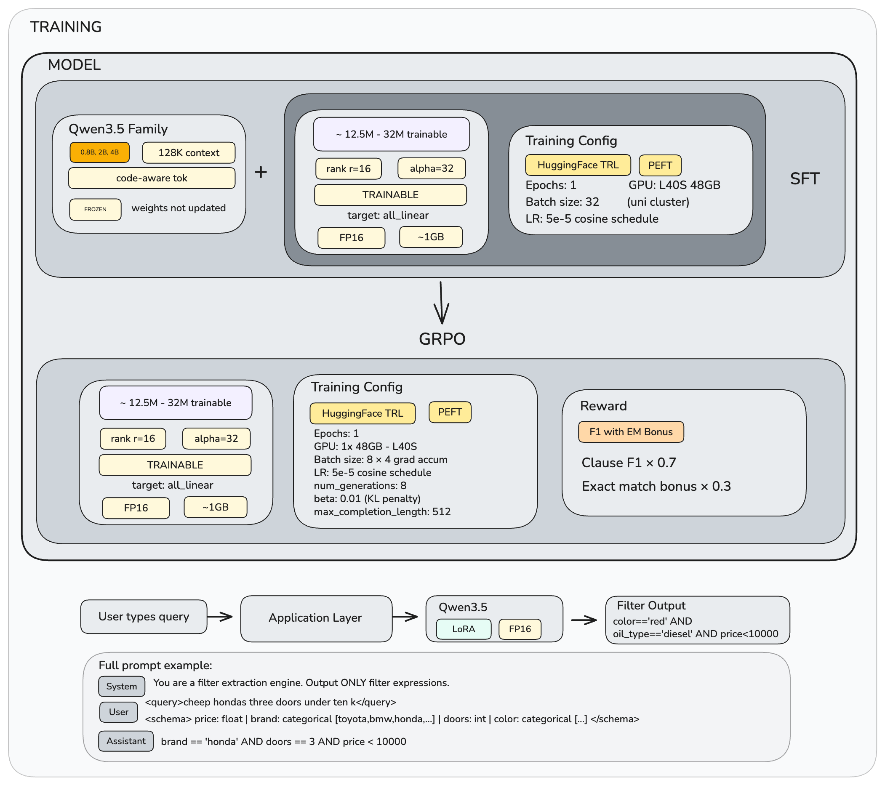
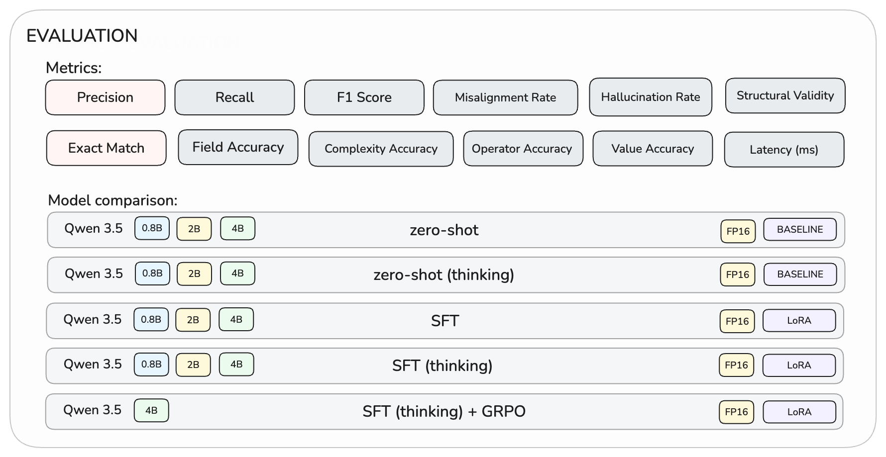
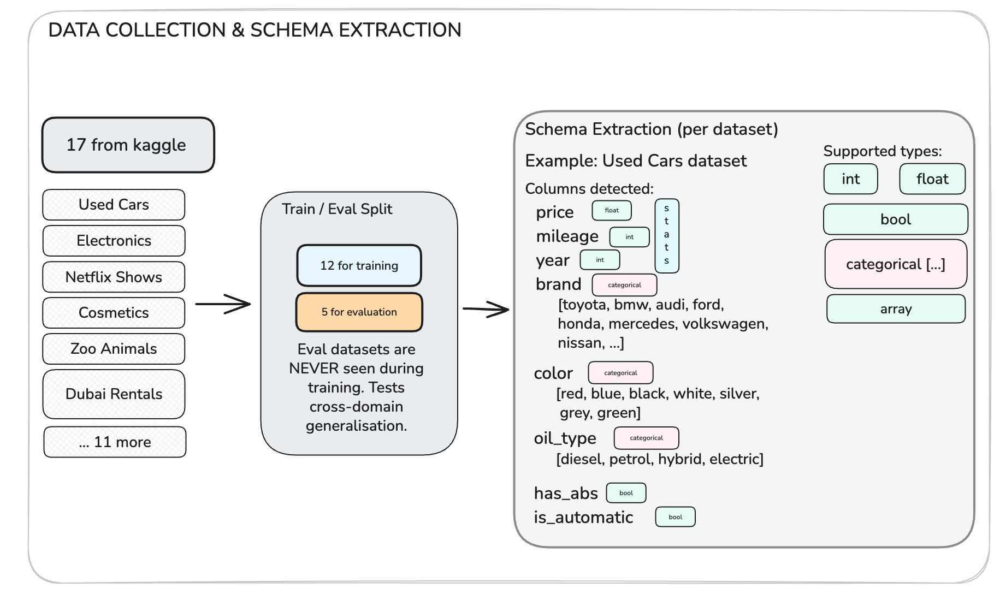

# AutoFilter

Convert natural-language queries into structured filter expressions using fine-tuned small LLMs.

```
User:  "cheap Toyota cars under 20k with low mileage"
Model: brand == 'toyota' AND price < 20000 AND mileage < 50000
```

Fine-tunes Qwen3.5 (0.8B/2B/4B) with LoRA in two stages: supervised fine-tuning (SFT) followed by GRPO reinforcement learning. Best model achieves **67.6% exact match** on 460 manually reviewed samples across 5 unseen schemas.

---

## How It Works



| Stage | What it does | Code |
|-------|-------------|------|
| Data loading | Load query-filter pairs, split by schema | `src/data_loader.py` |
| SFT | LoRA fine-tune with SFTTrainer | `src/train.py` |
| GRPO | Reward-based RL on best SFT model | `src/train_grpo.py` |
| Inference | Generate filters from queries | `src/inference.py` |
| Evaluation | 12 metrics, per-schema/difficulty breakdowns | `src/evaluate/` |

---

## Setup

Requires Python 3.10+ and a CUDA GPU (24GB+ VRAM).

```bash
# Install uv
curl -LsSf https://astral.sh/uv/install.sh | sh
source $HOME/.local/bin/env

# Clone and install
git clone -b main https://github.com/anardashdamir/UOE-mlp-cw-G083.git
cd UOE-mlp-cw-G083
uv venv venv --python 3.11
source venv/bin/activate
uv pip install -e .

# Verify
python main.py --help
```

For **SLURM** (UoE cluster), pre-download the model on the login node:

```bash
huggingface-cli download Qwen/Qwen3.5-4B
srun --partition=Teaching --gres=gpu:1 --time=12:00:00 --mem=36G --pty bash
# then activate venv and run training on the GPU node
```

---

## Training

### SFT

```bash
# Train with default config
python main.py sft

# Specify model and thinking mode
python main.py sft --model Qwen/Qwen3.5-4B --enable-thinking true

# Custom hyperparameters
python main.py sft --model Qwen/Qwen3.5-2B --lr 5e-5 --batch-size 32

# With W&B logging
python main.py sft --wandb --run-name "4b-thinking-v1"
```

Adapters are saved to `output/<Model>/<thinking_mode>/sft/`.

### GRPO

Applies reward-based RL on top of the best SFT checkpoint:

```bash
python main.py grpo \
    --model Qwen/Qwen3.5-4B \
    --enable-thinking true \
    --sft-adapter output/Qwen3.5-4B/thinking/sft
```

The reward function combines clause-level F1 (weight 0.7) with an exact match bonus (weight 0.3). GRPO adapter is saved to `output/<Model>/<thinking_mode>/grpo/`.

---

## Evaluation



```bash
# Evaluate SFT model
python main.py evaluate --model Qwen/Qwen3.5-4B --enable-thinking true

# Evaluate SFT + GRPO
python main.py evaluate \
    --model Qwen/Qwen3.5-4B \
    --enable-thinking true \
    --sft-adapter output/Qwen3.5-4B/thinking/sft \
    --grpo-adapter output/Qwen3.5-4B/thinking/grpo

# Zero-shot baseline
python main.py evaluate --model Qwen/Qwen3.5-4B --zero-shot
```

12 metrics across four categories:

| Category | Metrics |
|----------|---------|
| Core | Precision, Recall, F1, Exact Match |
| Schema | Field Accuracy, Misaligned Fields |
| Structural | Structural Validity, Complexity Accuracy, Hallucination Rate |
| Fine-grained | Operator Accuracy, Value Accuracy, Latency |

---

## Prediction

```bash
python main.py predict "cheap red Toyota cars" schemas/used_cars.json

# With adapter
python main.py predict "cheap cars" schemas/used_cars.json \
    --sft-adapter output/Qwen3.5-4B/thinking/sft
```

---

## Data



- **17 Kaggle schemas** split at the schema level: 12 for training, 5 for evaluation
- **2,091 training samples** across 23 difficulty categories
- **460 evaluation samples**, manually reviewed
- Queries include adversarial variants: typos, slang, abbreviations

Each schema is a JSON file listing column names, types, and value ranges:

```json
{
  "name": "used_cars",
  "columns": {
    "brand": { "type": "categorical", "values": ["toyota", "bmw", "ford"] },
    "price": { "type": "int", "min": 450, "max": 159999 },
    "mileage": { "type": "int", "min": 0, "max": 500000 }
  }
}
```

---

## Configuration

All settings in `config.yaml`. CLI flags override config values.

```yaml
model:
  name: Qwen/Qwen3.5-4B
  enable_thinking: true

lora:
  r: 16
  alpha: 32
  dropout: 0.05
  target_modules: all-linear

training:
  num_epochs: 1
  batch_size: 32
  learning_rate: 5e-5
  max_seq_length: 2048

grpo:
  batch_size: 8
  gradient_accumulation_steps: 4
  learning_rate: 5e-5
  num_generations: 8
  beta: 0.01
  max_steps: 50
```

---

## Project Structure

```
AutoFilter/
├── main.py                 # Entry point
├── config.yaml             # Hyperparameters
├── pyproject.toml          # Dependencies
├── src/
│   ├── cli.py              # CLI commands
│   ├── config.py           # Pydantic config
│   ├── data_loader.py      # Dataset loading
│   ├── train.py            # SFT training
│   ├── train_grpo.py       # GRPO training
│   ├── inference.py        # Model loading + generation
│   ├── training_utils.py   # Thinking mode, logging
│   └── evaluate/           # Evaluation framework
├── schemas/                # 17 JSON schemas
├── data/
│   ├── train.json          # 2,091 training samples
│   └── test.json           # 460 eval samples
├── scripts/                # Plotting, batch eval
├── docs/                   # Diagrams and plots
└── output/                 # Trained adapters
```
