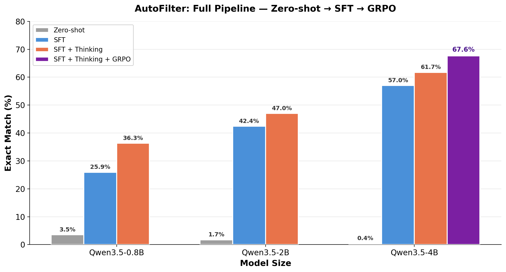
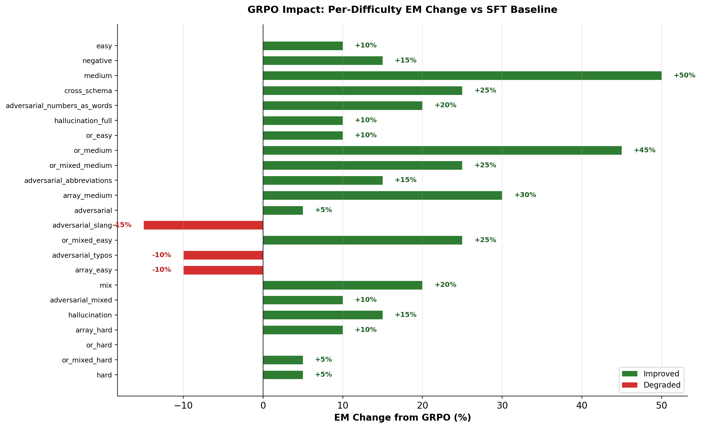
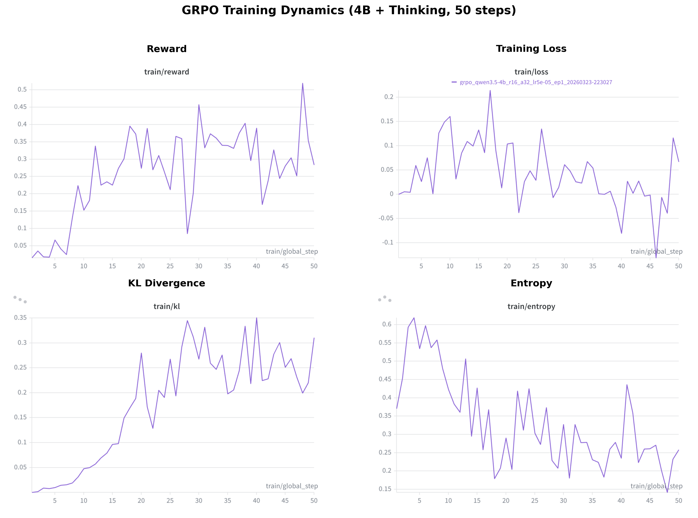
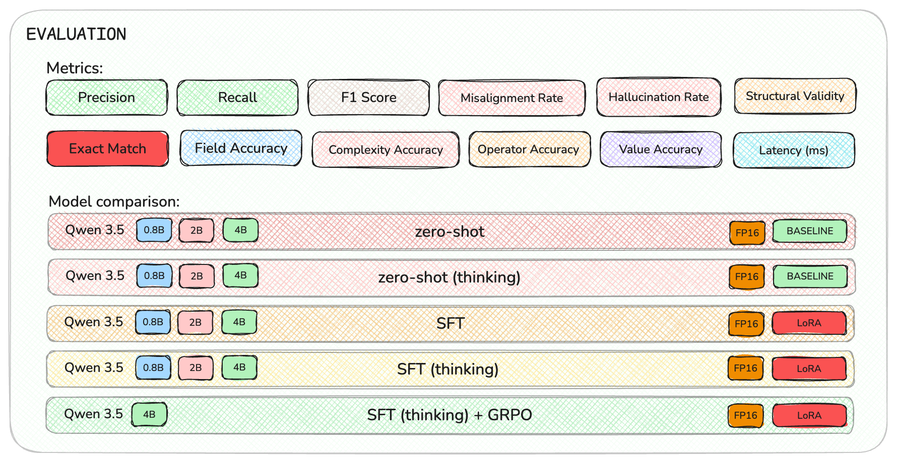
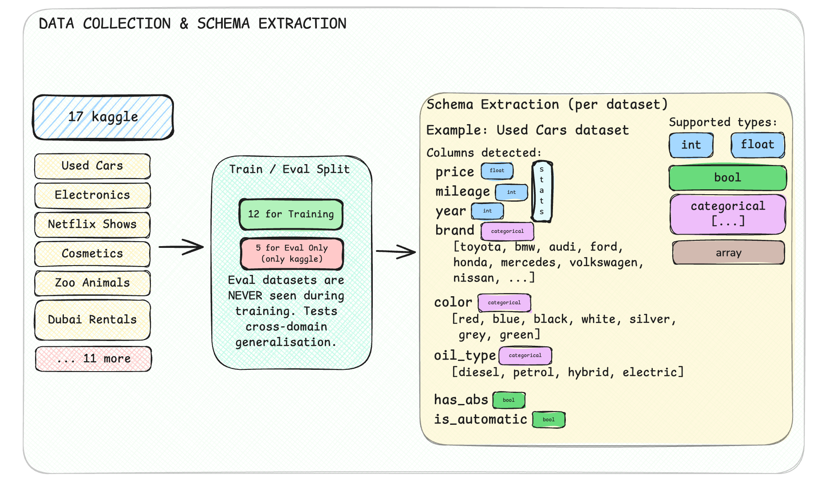
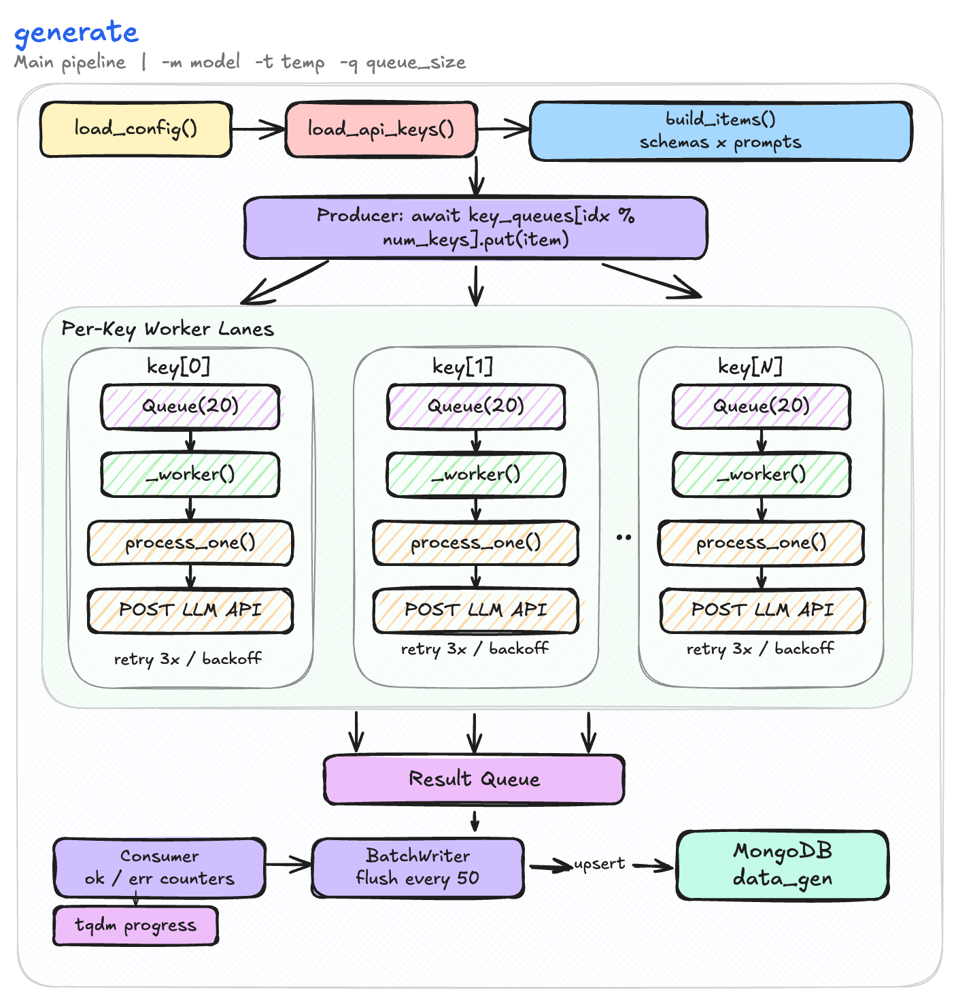
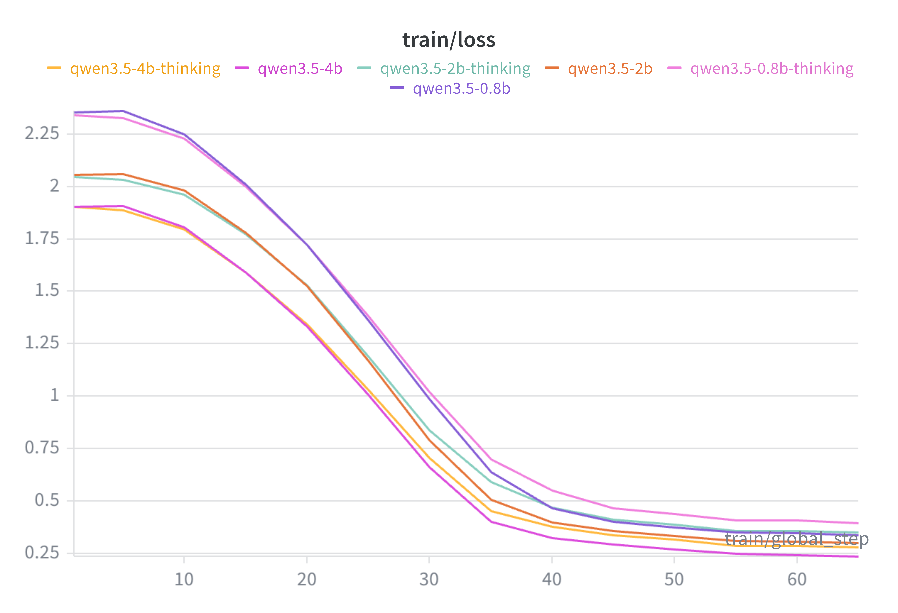
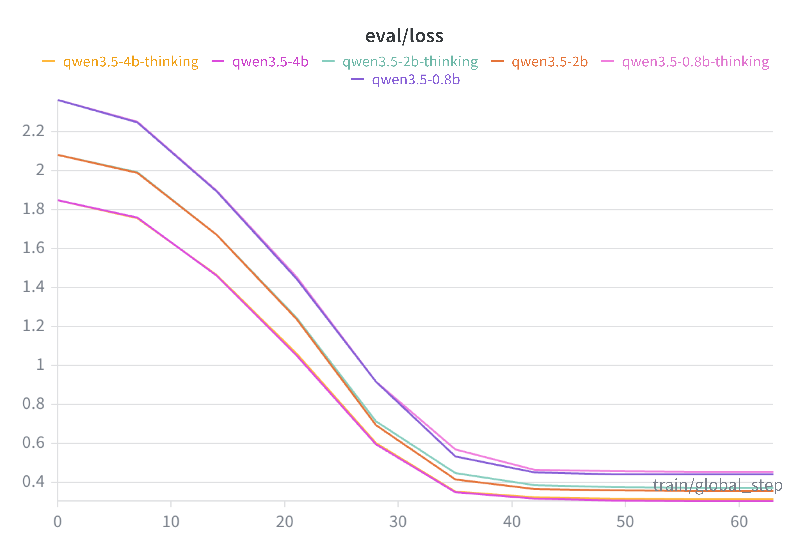

# NL-Filter: Natural Language to Structured Filter Extraction

## Abstract

Large language models can convert natural language queries into structured filters through prompting, but this is costly for production deployment. We present NL-Filter, a benchmark and baseline system for converting natural language queries into schema-aware filter expressions. The benchmark consists of 460 manually reviewed evaluation samples across 5 held-out schemas and 23 difficulty categories covering linguistic noise (typos, slang, abbreviations) and logical complexity (OR conditions, array operations, negation), evaluated with 12 metrics spanning structural validity, schema alignment, and semantic correctness. An additional 2,091 LLM-generated samples across 12 separate schemas are provided for training. For the baseline, we fine-tune Qwen3.5 models (0.8B, 2B, 4B) with LoRA in two stages: supervised fine-tuning (SFT) followed by Group Relative Policy Optimization (GRPO) with a clause-level F1 reward. Our best configuration (4B with thinking mode and GRPO) achieves 67.6% exact match and 85.7% F1, improving over the SFT-only baseline by 5.9 percentage points. Zero-shot baselines score below 4% exact match, confirming that filter generation requires explicit fine-tuning.

---

## 1. Introduction

Users interacting with structured data through search engines in e-commerce platforms, real estate agencies, and product catalogues need tools to translate natural language questions into structured queries. An e-commerce customer typing "cheap Nike shoes for men" expects the system to apply filters `brand == 'Nike' AND price < 80 AND gender == 'Men'`, and a renter searching "2-bedroom flat in Edinburgh under 1500" expects `bedrooms == 2 AND city == 'Edinburgh' AND rent < 1500`. Today, this translation is either hard-coded with rules or delegated to large API-based models, both of which scale poorly.

While benchmarks like Spider [1] and BIRD [2] have driven progress on full-blown text-to-SQL generation --- covering joins, aggregations, subqueries, and multi-table reasoning --- real-world filter extraction is a fundamentally simpler but distinct task. The output is a flat set of conditions over a single table, and user inputs are brief, informal, and noisy rather than well-formed questions. Existing benchmarks do not address this gap: they are either too complex (full SQL) or lack the adversarial linguistic variation (typos, slang, abbreviations) that characterizes real user queries.

An alternative to deploying large models at inference is using them to generate training data, then fine-tuning smaller models for production. SENSE [3] demonstrated this by using GPT-4 to synthesize question-SQL pairs, then fine-tuning CodeLLaMA to achieve competitive results. Recent work on reinforcement learning for structured outputs, particularly GRPO [4] as used in DeepSeek-R1 [5], has shown that rule-based rewards can further refine model outputs beyond what supervised learning achieves.

In this work, we introduce NL-Filter, a benchmark and baseline system for schema-aware natural language to structured filter extraction. We make three contributions:

1. **A benchmark** of 460 manually reviewed query-filter pairs across 5 held-out schemas, 23 difficulty categories, and 12 evaluation metrics, with schema-level splits to test cross-domain generalization. We also provide 2,091 training samples across 12 additional schemas.

2. **A systematic study** of model scaling (0.8B, 2B, 4B parameters) and reasoning mode (thinking vs. no thinking) effects on filter generation quality.

3. **A two-stage training pipeline** combining LoRA-based SFT with GRPO, where reward-based reinforcement learning improves exact match by 5.9 percentage points over the SFT baseline.

---

## 2. Related Work

### 2.1 Structured Query Benchmarks

WikiSQL [6] released over 80,000 question-query pairs but is limited to single-table lookups with simple conditions. Spider [1] introduced a cross-domain benchmark with 200 databases across 138 domains, including complex queries with aggregations, joins, and nested subqueries. BIRD [2] further increased realism with large-scale real-world databases and noisy values. Robustness-focused benchmarks such as Spider-SYN [7], Spider-DK [8], and Spider-Realistic [9] evaluate model performance under perturbations. These benchmarks target full query generation with multi-table reasoning; our work focuses specifically on flat filter extraction from informal user inputs --- a narrower but practically important task for applications like product search and listing platforms.

### 2.2 Synthetic Data Generation

The cost of annotating structured output datasets has motivated LLM-based data generation. SENSE [3] uses GPT-4 to create question-query pairs with controlled difficulty, achieving competitive performance when combined with human annotations. SQL-PaLM [10] demonstrates that synthetic augmentation improves structured output generation. Our approach similarly uses LLM-generated data but systematically controls both linguistic variation (typos, slang, abbreviations) and logical complexity (OR conditions, array operations, negation), with manual validation of the evaluation set.

### 2.3 Post-Training Reinforcement Learning

PPO [11] is widely used for RLHF but requires both a reward model and a critic network. DPO [12] eliminates the reward model by optimizing directly from preference pairs. GRPO [4] generates multiple outputs per prompt, scores them with a reward function, and updates the model based on relative ranking --- requiring neither a critic network nor preference pairs. GRPO was used in DeepSeek-R1 [5] to enable reasoning capabilities with verifiable rewards, and has since been applied to structured output tasks. We use GRPO with a task-specific reward combining clause-level F1 with an exact match bonus.

### 2.4 Parameter-Efficient Fine-Tuning

LoRA [13] introduces low-rank trainable matrices into frozen model layers, enabling fine-tuning with less than 2% of total parameters. QLoRA [14] extends this with 4-bit quantized base models. These methods make it feasible to fine-tune billion-parameter models on a single GPU. We apply LoRA to all linear layers of Qwen3.5 models [15], training approximately 12--32M parameters depending on model size.

---

## 3. Dataset and Task

### 3.1 Task Definition

Given a natural language query and a dataset schema consisting of column names, types, and value ranges, the model must produce a structured filter expression over the columns of that schema. Filter expressions consist of clauses joined by AND or OR operators, where each clause compares a schema field to a literal value using operators: `==`, `!=`, `<`, `<=`, `>`, `>=`, `IN`, `NOT IN`, `CONTAINS`. The model must not hallucinate fields absent from the schema. If no query terms match any schema field, the model should output EMPTY.

### 3.2 Schema Representation

For each of the 17 dataset schemas sourced from Kaggle, we extract a compact structured representation listing each column's name, type (categorical, int, float, bool, or array), and descriptive statistics. Numeric columns include min, max, and median values; categorical columns include the full set of valid values. This representation is provided to the model alongside the user query at inference time.

### 3.3 Data Generation

Training data was generated using a multi-model pipeline. Queries were produced across 23 difficulty categories grouped into: basic (easy, medium, hard), adversarial (typos, slang, abbreviations, numbers-as-words, mixed), OR filters (easy/medium/hard with mixed variants), array operations, and special categories (cross-schema, hallucination, negation, mix). Filter expressions were generated by providing each query and schema to an LLM, then validated through automated checks. The evaluation set of 460 samples was manually reviewed sample-by-sample to ensure correctness.

### 3.4 Dataset Splits

The dataset is split at the schema level: 12 schemas (~2,100 samples) for training and 5 schemas (460 samples) for evaluation. The evaluation schemas (anime, diamonds, diabetes, used_cars, adidas_vs_nike) are withheld entirely from training, ensuring that evaluation measures cross-domain generalization. Each difficulty category contains 20 samples across the 5 evaluation schemas.

---

## 4. Methodology

### 4.1 Model Selection

We experiment with three sizes from the Qwen3.5 model family [15]: 0.8B, 2B, and 4B parameters. Each model supports two inference modes: standard mode (direct generation) and thinking mode (chain-of-thought reasoning in `<think>` tags before the final output). Both modes are evaluated for each model size, yielding six SFT configurations.

### 4.2 SFT with LoRA

All models are fine-tuned using LoRA [13] with rank r=16, scaling factor alpha=32, dropout 0.05, applied to all linear layers. This yields approximately 12.5M (0.8B), 22M (2B), and 32.5M (4B) trainable parameters --- less than 1.6% of total parameters. Training uses a cosine learning rate schedule with peak rate 5e-5, 30 warmup steps, batch size 32, for 1 epoch on a single NVIDIA L40S 48GB GPU using HuggingFace TRL [16] with PEFT.

### 4.3 GRPO Post-Training

GRPO [4] is applied to the best SFT model (4B with thinking). The SFT adapter is merged into the base model, then a new LoRA adapter (same configuration) is trained with GRPO. For each prompt, 8 candidate completions are generated and scored by the reward function. The KL divergence from the reference policy is penalized with beta=0.01.

**Reward Function.** We use a combined F1 + exact match bonus:

> R = 0.7 x ClauseF1(predicted, expected) + 0.3 x ExactMatch(predicted, expected)

ClauseF1 is computed over normalized clause sets, providing smooth gradient signal through partial credit. ExactMatch is binary (1 if perfect, 0 otherwise), incentivizing exact correctness. We arrived at this through iteration: binary exact match alone was too sparse (most generations scored 0), and purely soft rewards led to reward hacking.

**Early stopping.** Training was stopped at 50 steps based on rising KL divergence (0.01 to 0.30) and falling output entropy (0.60 to 0.20), indicating that extended training would cause catastrophic forgetting of SFT knowledge.

---

## 5. Experimental Setup

### 5.1 Evaluation Metrics

Following established practice in structured output benchmarks [1, 2], we evaluate using 12 metrics organized into four categories. **Exact Match (EM)** is the primary metric, requiring the full predicted filter to match the ground truth after clause-level normalization (whitespace, casing, float formatting). This is analogous to execution accuracy in text-to-SQL benchmarks, but applied to filter expressions.

**Table 1: Evaluation metrics**

| Category | Metric | Description |
|---|---|---|
| **Core** | Exact Match (EM) | Full expression match after normalization |
| | Precision | Fraction of predicted clauses in ground truth |
| | Recall | Fraction of ground truth clauses predicted |
| | F1 | Harmonic mean of precision and recall |
| **Schema** | Field Accuracy | Fraction of predicted fields valid in schema |
| | Misaligned Fields | Predicted fields absent from schema |
| **Structure** | Structural Validity | Balanced parentheses + valid operators |
| | Complexity Accuracy | Correct clause count |
| | Hallucination Rate | Extra clauses not in ground truth |
| **Fine-grained** | Operator Accuracy | F1 over operator multiset (==, <, IN, ...) |
| | Value Accuracy | F1 over literal values (strings, numbers) |
| | Latency | Inference time per sample (ms) |

### 5.2 Evaluation Protocol

All models are evaluated on the same 460 manually reviewed samples across 5 unseen schemas. The evaluation schemas (anime, diamonds, diabetes, used\_cars, adidas\_vs\_nike) are withheld entirely from training, following the cross-domain evaluation protocol established by Spider [1]. Inference uses greedy decoding (temperature 0) in FP16 precision. Results are reported with breakdowns by schema and by difficulty category.

### 5.3 Configurations

We evaluate 13 configurations: 3 model sizes x 2 thinking modes x 2 stages (zero-shot, SFT), plus 1 GRPO configuration (4B + thinking).

**Table 2: Model configurations and trainable parameters**

| Model | Total Params | LoRA Params | Trainable % | Adapter Size |
|---|---|---|---|---|
| Qwen3.5-0.8B | ~0.8B | ~12.5M | 1.6% | 25 MB |
| Qwen3.5-2B | ~2.0B | ~22.0M | 1.1% | 44 MB |
| Qwen3.5-4B | ~4.2B | ~32.5M | 0.8% | 74 MB |

---

## 6. Results

### 6.1 Main Results

Table 3 presents the main results across all configurations. We report EM, F1, field accuracy (FA), hallucination rate (HR), and structural validity (SV).

**Table 3: Main results across all configurations (460 eval samples, 5 unseen schemas)**

| # | Model | Stage | Think | EM | F1 | Prec | Rec | FA | HR | SV |
|---|---|---|---|---|---|---|---|---|---|---|
| 1 | 0.8B | Zero-shot | No | 3.5 | .062 | .061 | .070 | .181 | 93.9 | 92.2 |
| 2 | 2B | Zero-shot | No | 1.7 | .039 | .037 | .043 | .119 | 95.8 | 86.5 |
| 3 | 4B | Zero-shot | No | 0.4 | .027 | .023 | .037 | .101 | 97.7 | 85.7 |
| 4 | 0.8B | SFT | No | 25.9 | .581 | .581 | .604 | .972 | 41.9 | 100.0 |
| 5 | 0.8B | SFT | Yes | 36.3 | .640 | .640 | .658 | .908 | 36.0 | 99.6 |
| 6 | 2B | SFT | No | 42.4 | .702 | .709 | .712 | .936 | 29.1 | 95.4 |
| 7 | 2B | SFT | Yes | 47.0 | .716 | .727 | .716 | .930 | 27.3 | 98.7 |
| 8 | 4B | SFT | No | 57.0 | .774 | .787 | .770 | .907 | 21.3 | 93.0 |
| 9 | 4B | SFT | Yes | 61.7 | .826 | .829 | .831 | .925 | 17.1 | 95.9 |
| **10** | **4B** | **SFT+GRPO** | **Yes** | **67.6** | **.857** | **.855** | **.868** | **.932** | **14.5** | **96.1** |

*Figure 1: Exact match across all training stages and model sizes.*

### 6.2 Per-Schema Breakdown

Table 4 shows performance on each evaluation schema for the best model (4B + thinking + GRPO). Performance is relatively consistent across domains, with used\_cars achieving the highest EM (75.0%) and anime the lowest (62.0%).

**Table 4: Per-schema results — best model (4B + thinking + GRPO)**

| Schema | Domain | N | EM | F1 | Prec | Rec | FA |
|---|---|---|---|---|---|---|---|
| adidas\_vs\_nike | E-commerce | 92 | 68.5 | .887 | .873 | .914 | .927 |
| anime | Entertainment | 92 | 62.0 | .821 | .820 | .830 | .926 |
| diabetes | Health | 92 | 66.3 | .849 | .846 | .860 | .951 |
| diamonds | Luxury goods | 92 | 66.3 | .838 | .842 | .842 | .913 |
| used\_cars | Automotive | 92 | 75.0 | .890 | .890 | .894 | .944 |
| **Overall** | | **460** | **67.6** | **.857** | **.855** | **.868** | **.932** |

### 6.3 Per-Difficulty Breakdown

Table 5 groups the 23 difficulty categories into 5 difficulty tiers and reports aggregate EM for three key configurations: zero-shot (4B), SFT (4B + thinking), and GRPO (4B + thinking).

**Table 5: Per-difficulty tier results (EM %)**

| Tier | Categories | N | Zero-shot | SFT | GRPO | GRPO - SFT |
|---|---|---|---|---|---|---|
| **Easy** | easy, negative, cross\_schema | 60 | 0.0 | 81.7 | **98.3** | +16.7 |
| **Adversarial** | typos, slang, abbrev, numbers, mixed | 100 | 1.0 | 68.0 | **75.0** | +7.0 |
| **Medium** | medium, mix, hallucination, halluc\_full | 80 | 0.0 | 48.8 | **72.5** | +23.8 |
| **OR/Array** | or\_\*, array\_\*, or\_mixed\_\* | 180 | 0.0 | 43.3 | **55.6** | +12.2 |
| **Hard** | hard, or\_hard, array\_hard, or\_mixed\_hard | 80 | 0.0 | 7.5 | **11.3** | +3.8 |
| **Overall** | all 23 categories | 460 | 0.4 | 61.7 | **67.6** | +5.9 |

**Table 6: Detailed per-category EM — SFT vs GRPO (4B + thinking)**

| Category | N | SFT EM | GRPO EM | Delta |
|---|---|---|---|---|
| easy | 20 | 90 | **100** | +10 |
| medium | 20 | 45 | **95** | **+50** |
| hard | 20 | 0 | 5 | +5 |
| negative | 20 | 85 | **100** | +15 |
| cross\_schema | 20 | 70 | **95** | **+25** |
| mix | 20 | 30 | **50** | +20 |
| adversarial | 20 | 70 | **75** | +5 |
| adversarial\_abbreviations | 20 | 65 | **80** | +15 |
| adversarial\_mixed | 20 | 40 | **50** | +10 |
| adversarial\_numbers\_as\_words | 20 | 75 | **95** | **+20** |
| adversarial\_slang | 20 | 90 | 75 | -15 |
| adversarial\_typos | 20 | 80 | 70 | -10 |
| array\_easy | 20 | 65 | 55 | -10 |
| array\_medium | 20 | 50 | **80** | **+30** |
| array\_hard | 20 | 15 | **25** | +10 |
| or\_easy | 20 | 80 | **90** | +10 |
| or\_medium | 20 | 45 | **90** | **+45** |
| or\_hard | 20 | 10 | 10 | 0 |
| or\_mixed\_easy | 20 | 50 | **75** | +25 |
| or\_mixed\_medium | 20 | 60 | **85** | +25 |
| or\_mixed\_hard | 20 | 5 | 10 | +5 |
| hallucination | 20 | 35 | **50** | +15 |
| hallucination\_full | 20 | 85 | **95** | +10 |

*Figure 2: SFT vs GRPO per-difficulty exact match (4B + thinking).*

*Figure 3: GRPO improvement delta per difficulty — green = improved, red = degraded.*

### 6.4 Ablation Studies

**Effect of model scaling.** Table 7 isolates the effect of model size by comparing configurations with the same thinking mode.

**Table 7: Scaling ablation (SFT, EM %)**

| | 0.8B | 2B | 4B | 0.8B→2B | 2B→4B |
|---|---|---|---|---|---|
| No Thinking | 25.9 | 42.4 | 57.0 | +16.5 | +14.6 |
| Thinking | 36.3 | 47.0 | 61.7 | +10.7 | +14.7 |

**Effect of thinking mode.** Table 8 isolates the effect of thinking by comparing same-size models.

**Table 8: Thinking ablation (SFT, EM %)**

| Model | No Thinking | Thinking | Delta | Relative |
|---|---|---|---|---|
| 0.8B | 25.9 | 36.3 | +10.4 | +40.2% |
| 2B | 42.4 | 47.0 | +4.6 | +10.8% |
| 4B | 57.0 | 61.7 | +4.7 | +8.2% |

*Figure 4: Thinking vs no thinking across model sizes.*

*Figure 5: Thinking mode EM gain — smaller models benefit disproportionately.*

**Effect of GRPO.** Table 9 isolates the effect of GRPO by comparing the same base model before and after RL.

**Table 9: GRPO ablation (4B + thinking)**

| Metric | SFT | SFT+GRPO | Delta |
|---|---|---|---|
| EM | 61.7 | **67.6** | +5.9 |
| F1 | .826 | **.857** | +.031 |
| Precision | .829 | .855 | +.026 |
| Recall | .831 | **.868** | +.037 |
| Field Accuracy | .925 | **.932** | +.007 |
| Hallucination Rate | 17.1 | **14.5** | -2.6 |
| Operator Accuracy | .883 | **.908** | +.025 |
| Value Accuracy | .918 | .917 | -.001 |

### 6.5 Scaling Behavior

*Figure 6: Scaling from zero-shot through SFT to GRPO. The curve has not saturated, suggesting larger models would continue to improve.*

### 6.6 GRPO Training Dynamics

*Figure 7: GRPO training dynamics over 50 steps. Top-left: reward trends upward. Top-right: training loss. Bottom-left: KL divergence rises steadily. Bottom-right: entropy drops, signaling output diversity collapse.*

Training was stopped at step 50 based on rising KL (0.01→0.30) and falling entropy (0.60→0.20). A critical finding: initial experiments produced zero reward because thinking mode was not activated during GRPO generation. Fixing this tokenizer mismatch was essential for GRPO to function.

### 6.7 Error Analysis

We manually inspected 50 errors from the best model to categorize failure modes.

**Table 10: Error categorization (50 sampled errors, 4B + thinking + GRPO)**

| Error Type | Count | % | Example |
|---|---|---|---|
| Missing OR parentheses | 12 | 24% | `a OR b AND c` instead of `(a OR b) AND c` |
| Wrong operator for vague terms | 9 | 18% | `price < 50` vs `price <= 50` for "under 50" |
| Hallucinated extra clause | 8 | 16% | Added `rating > 4` when query only asked for price |
| Wrong value (close) | 7 | 14% | `mileage < 50000` vs `mileage < 40000` |
| Missing clause | 6 | 12% | Dropped one condition from multi-filter query |
| Field name confusion | 5 | 10% | `brand` vs `Brand` (case sensitivity) |
| Wrong IN/== choice | 3 | 6% | `genre == 'Action'` vs `genre IN ['Action']` |

The dominant errors (parenthesization 24%, operator choice 18%) are syntactic precision failures rather than comprehension failures — the model understands the query intent but makes errors in formal expression.

---

## 7. Analysis and Discussion

### 7.1 Model Size is the Dominant Factor

Scaling from 0.8B to 4B provides 31 percentage points of EM gain (25.9% to 57.0% without thinking). Each size step contributes 14-16% EM, and the scaling curve shows no saturation, suggesting larger models (7B+) would continue to improve.

### 7.2 Thinking Mode Benefits Smaller Models More

The 0.8B model gains +10.4% EM from thinking (40% relative), while 4B gains +4.7% (8% relative). This asymmetry indicates that smaller models lack the implicit reasoning capacity to map natural language to filter syntax and rely on explicit chain-of-thought to compensate. As model capacity increases, more of this reasoning is internalized.

### 7.3 GRPO Targets the Uncertainty Boundary

GRPO gains concentrate where SFT achieves ~50% EM (Table 6). At this boundary, roughly half of 8 sampled generations are correct, providing maximum reward variance for the policy gradient. Easy categories (all 8 correct, variance=0) and hard categories (all 8 wrong, variance=0) show minimal change. This is consistent with the theoretical analysis of GRPO in [4]: the algorithm requires within-group variance to compute meaningful advantages.

### 7.4 The F1-EM Gap

Our best model achieves 85.7% F1 but only 67.6% EM — an 18-point gap. The error analysis (Table 10) shows this gap is driven by syntactic precision failures: missing parentheses (24%), wrong operators (18%), and hallucinated clauses (16%). The model understands query intent but makes errors in formal expression — suggesting that targeted data augmentation for these specific error types could close the gap.

### 7.5 Data Quality as a Limiting Factor

The evaluation set (460 samples) was manually reviewed, while training data (~2,100 samples) was LLM-generated with automated validation (~95% accuracy). An estimated 100+ training samples may contain subtle errors. The impact is visible in hard categories where training data quality matters most, as these require precise multi-step reasoning sensitive to inconsistencies in the training signal.

### 7.6 Practical Deployment

**Table 11: Deployment configurations**

| Scenario | Config | EM | F1 | Latency | GPU RAM |
|---|---|---|---|---|---|
| Maximum accuracy | 4B + Think + GRPO | 67.6% | .857 | ~657ms | ~10 GB |
| High accuracy | 4B + Think (SFT) | 61.7% | .826 | ~411ms | ~10 GB |
| Low latency | 4B No Think | 57.0% | .774 | ~286ms | ~10 GB |
| Balanced | 2B + Think | 47.0% | .716 | ~256ms | ~5 GB |
| Edge / mobile | 0.8B + Think | 36.3% | .640 | ~316ms | ~2 GB |

---

## 8. Conclusion

We presented NL-Filter, a benchmark and baseline for natural language to structured filter extraction. Through systematic experiments across three model sizes and two reasoning modes, we demonstrated that: (1) filter extraction requires explicit fine-tuning, with zero-shot performance below 4% EM; (2) model scaling is the dominant factor, with each size step providing 14-16% EM gain; (3) thinking mode provides asymmetric benefits, helping smaller models more; and (4) GRPO with a clause-level F1 reward improves EM by 5.9% over SFT, with gains concentrated on medium-difficulty queries where reward variance is highest. Our best configuration achieves 67.6% EM and 85.7% F1 on 460 manually reviewed samples across 5 unseen schemas.

Future work includes scaling to larger models (7B+), manual review of training data, adaptive KL scheduling for extended GRPO training, and evaluation on real user queries from production systems.

---

## Appendix

### A. Architecture Diagrams

*Figure A1: Two-stage training pipeline — SFT with LoRA followed by GRPO.*

*Figure A2: Evaluation framework with 12 metrics across 4 categories.*

### B. Data Pipeline

*Figure B1: Schema extraction pipeline — column types, value ranges, and statistics.*

*Figure B2: Synthetic data generation with 23 difficulty categories.*

*Figure B3: Dataset design — 17 Kaggle schemas split into 12 training and 5 evaluation.*

### C. Additional Results

*Figure C1: Multi-metric comparison (EM, F1, Field Accuracy, Structural Validity) across sizes.*

### D. Training Curves

*Figure D1: SFT training loss curves across all 6 configurations.*

*Figure D2: SFT evaluation loss curves.*

---

## References

[1] Yu et al. "Spider: A Large-Scale Human-Labeled Dataset for Complex and Cross-Domain Semantic Parsing and Text-to-SQL Task." EMNLP 2018.

[2] Li et al. "Can LLM Already Serve as a Database Interface? A Big Bench for Large-Scale Database Grounded Text-to-SQLs." NeurIPS 2023.

[3] Yang et al. "Synthesizing Text-to-SQL Data from Weak and Strong LLMs." arXiv:2408.03256, 2024.

[4] Shao et al. "DeepSeekMath: Pushing the Limits of Mathematical Reasoning in Open Language Models." arXiv:2402.03300, 2024.

[5] Guo et al. "DeepSeek-R1: Incentivizing Reasoning Capability in LLMs via Reinforcement Learning." arXiv:2501.12948, 2025.

[6] Zhong et al. "Seq2SQL: Generating Structured Queries from Natural Language using Reinforcement Learning." arXiv:1709.00103, 2017.

[7] Gan et al. "Towards Robustness of Text-to-SQL Models against Synonym Substitution." arXiv:2106.01065, 2021.

[8] Gan et al. "Towards Robustness of Text-to-SQL Models: Evaluating and Enhancing Generalization." ACL 2021.

[9] Deng et al. "Structure-Grounded Pretraining for Text-to-SQL." NAACL 2021.

[10] Sun et al. "SQL-PaLM: Improved Large Language Model Adaptation for Text-to-SQL." arXiv:2306.00739, 2024.

[11] Schulman et al. "Proximal Policy Optimization Algorithms." arXiv:1707.06347, 2017.

[12] Rafailov et al. "Direct Preference Optimization: Your Language Model is Secretly a Reward Model." arXiv:2305.18290, 2024.

[13] Hu et al. "LoRA: Low-Rank Adaptation of Large Language Models." ICLR 2022.

[14] Dettmers et al. "QLoRA: Efficient Finetuning of Quantized Language Models." NeurIPS 2023.

[15] Qwen Team. "Qwen3.5 Technical Report." 2026.

[16] von Werra et al. "TRL: Transformer Reinforcement Learning." GitHub, 2020.
