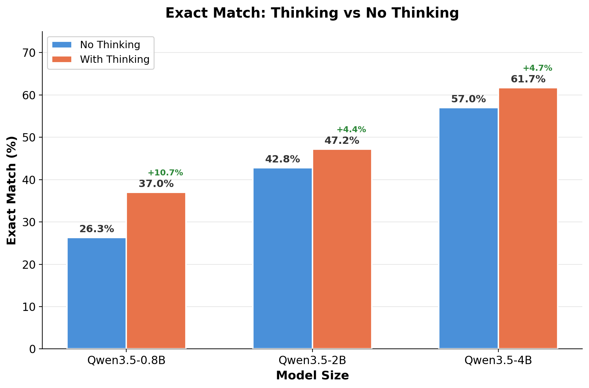
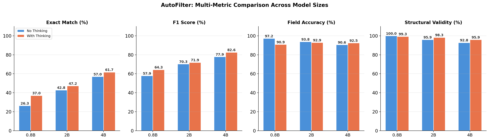
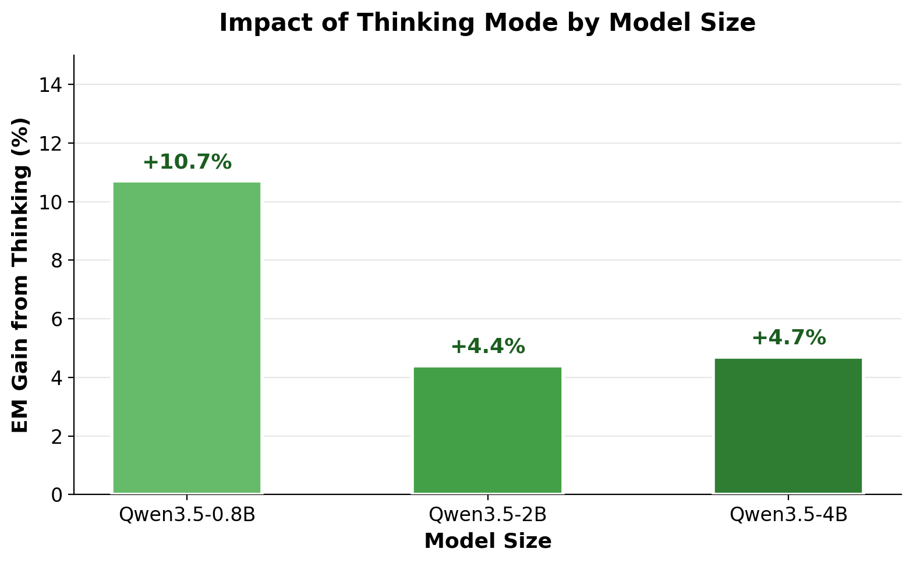
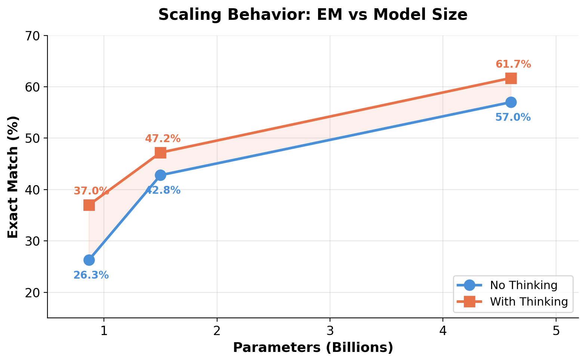
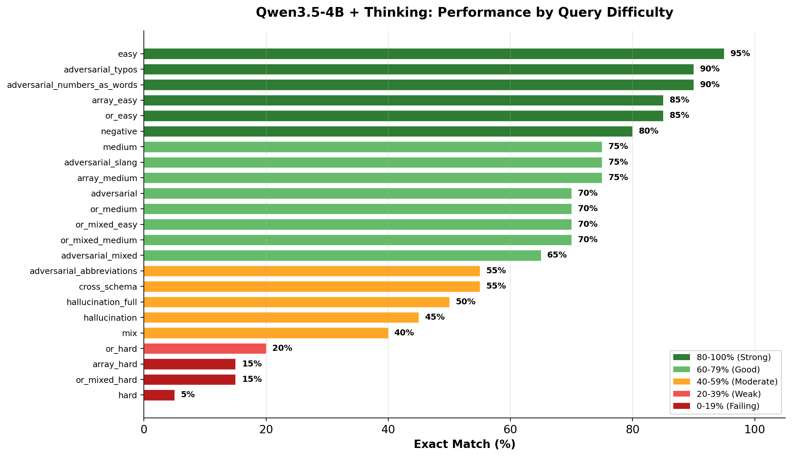

# AutoFilter: Natural Language to Structured Filter — Benchmark Results

## Task
Converting natural language queries into structured filter expressions using LoRA-finetuned small language models. For example:
- Query: *"cheap Nike shoes for men"*
- Filter: `brand == 'Nike' AND price < 80 AND gender == 'Men'`

## Experimental Setup

| Component | Details |
|---|---|
| **Models** | Qwen3.5-0.8B, Qwen3.5-2B, Qwen3.5-4B |
| **Method** | SFT with LoRA (r=16, alpha=32, dropout=0.05) |
| **Learning Rate** | 5e-5 with cosine scheduler |
| **Training Data** | ~2,100 samples across 12 schemas |
| **Eval Data** | 460 manually reviewed samples across 5 unseen schemas |
| **Eval Schemas** | anime, diamonds, diabetes, used_cars, adidas_vs_nike |
| **Query Types** | 23 types (easy, medium, hard, adversarial, OR, hallucination, etc.) |
| **Hardware** | NVIDIA L40S 48GB |
| **Framework** | Unsloth + TRL SFTTrainer |

## Best Results Per Configuration

| Model | Thinking | **EM** | **F1** | Field Acc | Struct Val |
|---|---|---|---|---|---|
| Qwen3.5-0.8B | No | 26.3% | 0.579 | 0.972 | 100.0% |
| Qwen3.5-0.8B | Yes | 37.0% | 0.643 | 0.909 | 99.3% |
| Qwen3.5-2B | No | 42.8% | 0.703 | 0.938 | 95.9% |
| Qwen3.5-2B | Yes | 47.2% | 0.719 | 0.929 | 98.3% |
| Qwen3.5-4B | No | 57.0% | 0.779 | 0.906 | 92.8% |
| **Qwen3.5-4B** | **Yes** | **61.7%** | **0.826** | **0.925** | **95.9%** |

## Visualizations

### Exact Match: Thinking vs No Thinking

### Multi-Metric Comparison Across Model Sizes

### Impact of Thinking Mode by Model Size

### Scaling Behavior

### Performance by Query Difficulty (Best Model: 4B + Thinking)

## Ablation Studies

### Effect of Thinking Mode

| Model | No Thinking | With Thinking | Gain |
|---|---|---|---|
| 0.8B | 26.3% | 37.0% | **+10.7%** |
| 2B | 42.8% | 47.2% | **+4.4%** |
| 4B | 57.0% | 61.7% | **+4.7%** |

### Effect of Model Scaling

| | 0.8B | 2B | 4B |
|---|---|---|---|
| No Thinking | 26.3% | 42.8% (+16.5) | 57.0% (+14.2) |
| With Thinking | 37.0% | 47.2% (+10.2) | 61.7% (+14.5) |

## Analysis

### 1. Model Size is the Dominant Factor

Scaling from 0.8B to 4B yields the largest performance improvements, with each size step providing approximately 14-16% EM gain. The 4B model at 61.7% EM achieves more than double the performance of the 0.8B model at 26.3%. This near-linear scaling with parameter count suggests that the structured filter generation task fundamentally benefits from increased model capacity. Larger models can better internalize the complex mapping rules between natural language expressions and filter syntax — including operator selection, value type matching, schema field identification, and logical connector placement. The scaling curve has not yet flattened, indicating that even larger models (7B+) would likely continue to improve.

### 2. Thinking Mode Provides Asymmetric Benefits

Enabling the built-in chain-of-thought reasoning mechanism improves all model sizes, but the magnitude of improvement is inversely proportional to model capacity. The 0.8B model gains +10.7% EM from thinking — nearly half of its total performance — while the 4B model gains +4.7%. This pattern reveals that smaller models rely disproportionately on the explicit reasoning scaffold to compensate for their limited implicit reasoning ability. For the 0.8B model, the thinking step effectively externalizes computations that it cannot perform internally, while the 4B model already handles much of this reasoning implicitly through its larger parameter space. Importantly, thinking consistently improves structural validity across all sizes, meaning models produce fewer syntactically malformed outputs when they reason step-by-step before generating the final filter.

### 3. The F1-EM Gap Reveals Systematic Partial Failures

Our best model achieves 82.6% F1 but only 61.7% EM — a 21-point gap that persists across all configurations. Since F1 measures clause-level overlap while EM requires the entire expression to be exactly correct, this gap indicates that the model frequently generates filters that are partially correct but contain small errors that break exact match. Analysis of failure cases reveals recurring patterns: missing parentheses in OR groups, using `==` instead of `>=` for "at least" queries, confusing `brand` and `sub_brand` fields in the adidas_vs_nike schema, and occasionally hallucinating non-schema fields. These are precision failures rather than comprehension failures — the model understands the query intent but makes errors in the formal expression.

### 4. Data Quality as a Limiting Factor

A critical limitation of this work is the asymmetry between training and evaluation data quality. The evaluation benchmark (460 samples) was **manually reviewed** sample by sample to ensure correctness of each query-filter pair. In contrast, the training data (~2,100 samples) was generated by an LLM (Kimi K2.5) and validated only through automated checks and LLM-as-judge validation using multiple models (Kimi K2.5, Gemini Flash Lite, MiniMax M2.7). While this automated validation identified and fixed hundreds of issues — including wrong operators, hallucinated conditions, incorrect OR scoping, and wrong vague term thresholds — it cannot match the thoroughness of manual human review. Our validation experiments showed that even the best automated validator (Kimi K2.5) achieves only ~95% accuracy with ~5% false positive rate. This means an estimated 100-150 training samples may still contain subtle errors that teach the model incorrect mappings. The impact is particularly visible in complex query types (hard, or_hard, or_mixed_hard) where training data quality matters most, as these require precise multi-step reasoning that is sensitive to any inconsistencies in the training signal.

### 5. Structural Validity vs Field Accuracy Tradeoff

An unexpected finding is the inverse relationship between thinking mode and field accuracy. Models without thinking achieve higher field accuracy (0.972 for 0.8B) while thinking models show slightly lower field accuracy (0.909-0.925) but higher structural validity. This suggests that the thinking process, while helping with syntax planning and logical structure, occasionally introduces field name hallucinations during reasoning. The model may "overthink" and reference fields it discussed in its reasoning step but that don't exist in the schema. This is particularly evident in hallucination_full queries, where thinking models sometimes generate filters instead of correctly outputting EMPTY — they reason about the query terms and convince themselves that mappings exist when they don't.

### 6. Eval Loss Does Not Correlate with Task Performance

Throughout our training experiments, we consistently observed that evaluation loss is not a reliable proxy for exact match accuracy. In one experiment, a model trained with 1,300 samples achieved eval loss of 0.316 but only 56.3% EM, while the same architecture trained with 3,335 samples achieved higher eval loss of 0.343 but better EM of 60.9%. This counterintuitive finding has an important explanation: eval loss measures token-level prediction accuracy, rewarding the model for memorizing specific filter sequences. EM measures whether the entire filter expression is functionally correct — a much stricter criterion that rewards generalization. The model with lower loss had memorized more training examples precisely but generalized less effectively to unseen schemas and query patterns. This finding motivated our decision to evaluate every checkpoint independently rather than relying on `load_best_model_at_end` based on loss.

### 7. Per-Difficulty Analysis Reveals Clear Capability Boundaries

The difficulty breakdown of our best model (4B + thinking) reveals a clear hierarchy of task complexity:

- **Mastered (80-95% EM)**: easy, adversarial_typos, adversarial_numbers_as_words, array_easy, or_easy, negative — these involve straightforward field mapping with clear operators
- **Competent (60-75% EM)**: medium, adversarial_slang, adversarial, adversarial_mixed, array_medium, or_medium, or_mixed_easy, or_mixed_medium — these require handling multiple conditions or informal language
- **Struggling (40-55% EM)**: hallucination, hallucination_full, cross_schema, mix, adversarial_abbreviations — these require understanding what NOT to filter on
- **Failing (5-20% EM)**: hard, or_hard, or_mixed_hard, array_hard — these require complex multi-step reasoning with vague terms, nested OR/AND logic, and implicit mappings

The sharp drop-off in hard query types suggests that the model has learned the syntax and basic mapping rules but has not fully internalized the reasoning required for complex query interpretation. This is consistent with the model size being the bottleneck — hard queries require implicit reasoning chains that 4B parameters cannot fully represent.

### 8. Training Dynamics and Optimal Stopping

All models peaked between checkpoint 56-66 out of 66 total steps (85-100% through the epoch), with the learning rate schedule (cosine with warmup=30, lr=5e-5) and dropout (0.05) preventing catastrophic overfitting. Smaller models (0.8B) peaked slightly earlier (checkpoint-56) while larger models (4B) continued improving through the final checkpoint. This is consistent with the capacity argument — smaller models fill their parameter space faster and begin overfitting sooner, while larger models can continue absorbing training signal. The dropout of 0.05, while flagged by Unsloth as sub-optimal for performance, appears to have provided meaningful regularization given our relatively small training set of ~2,100 samples.

### 9. Practical Deployment Recommendations

| Scenario | Recommended Config | EM | Inference Cost |
|---|---|---|---|
| Maximum accuracy | 4B + Thinking | 61.7% | High (thinking tokens + 4B) |
| Low latency | 4B No Thinking | 57.0% | Medium (4B only) |
| Balanced | 2B + Thinking | 47.2% | Medium (thinking + 2B) |
| Edge / mobile | 0.8B + Thinking | 37.0% | Low (thinking + 0.8B) |
| Minimum resources | 0.8B No Thinking | 26.3% | Minimal |

### 10. Future Work

Several directions could push performance beyond the current 61.7% ceiling:
- **More training data**: Performance scaled from 56.3% → 60.9% when increasing from 1,300 to 3,335 samples, suggesting the data scaling curve has not saturated
- **Manual training data review**: Closing the quality gap between training and evaluation data could yield significant gains, particularly for hard query types
- **GRPO reinforcement learning**: Our initial GRPO experiments with binary exact-match reward showed no improvement, but more sophisticated reward functions (clause-level F1, field accuracy bonus, hallucination penalty) combined with LoRA-based GRPO may be more effective
- **Larger models**: The scaling curve shows no saturation — Qwen2.5-7B or Qwen3-8B could potentially reach 70%+ EM
- **Better reasoning traces**: The current reasoning data was generated programmatically rather than through genuine chain-of-thought, limiting the quality of the thinking supervision signal
